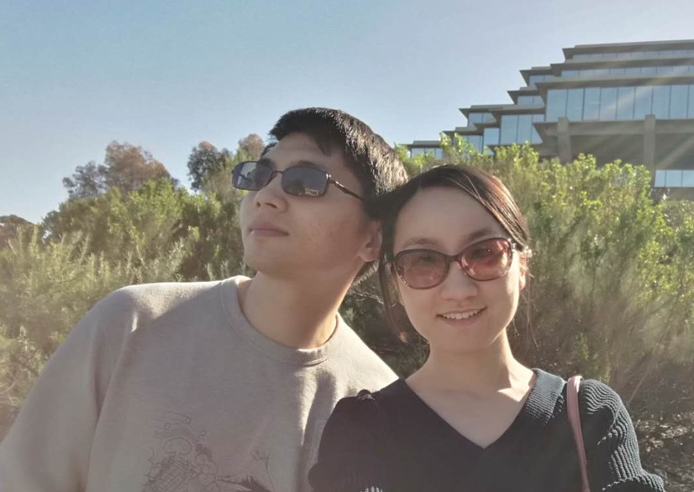

  <table width="700" border="0" align="center" cellspacing="0" cellpadding="0">
    <tr>
     <td width="68%" valign="middle">
        

        I am currently a research scientist at Facebook. I completed PhD in Computer Science from the University of Texas at Austin in 2019. My PhD supervisor is Prof. <a href="https://www.cs.utexas.edu/~lili/">Lili Qiu</a>. My PhD research focuses on mobile computing and wireless networking. I received my B.S. degree and M.S. degree from Shanghai Jiao Tong University, and my Master supervisor is Prof. <a href="http://wanglab.sjtu.edu.cn/en/content.aspx?info_lb=472&flag=295">Xudong Wang</a>.
       

       

       I am honored to receive the <a href="https://www.sigmobile.org/grav/awards/phd-thesis-award">ACM SIGMOBILE Doctoral Dissertation Award 2020</a>.
        

       I can be reached at <a href="mailto:maowenguang1987@gmail.com">maowenguang1987@gmail.com</a> 
        </td>
        <td width="30%">
        
        </td>
      </tr>
      </table>

---

## Selected Publications

*See my [google scholar page](https://scholar.google.com/citations?user=_jeddYwAAAAJ&hl=en) for all publications.*

- **Wenguang Mao**, Mei Wang, Wei Sun, Lili Qiu, Swadhin Pradhan, Yi-Chao Chen, “RNN-based Room Scale Hand Motion Tracking,” in Proceedings of ACM MobiCom 2019.

- **Wenguang Mao**, Mei Wang, Lili Qiu, “AIM: Acoustic Imaging on a Mobile,” **best paper award**, in Proceedings of ACM MobiSys 2018.

- **Wenguang Mao**, Zaiwei Zhang, Lili Qiu, Jian He, Yuchen Cui, Sangki Yun, “Indoor Follow Me Drone,” **best paper nomination**, in Proceedings of ACM MobiSys 2017.

- **Wenguang Mao**, Jian He, and Lili Qiu, “CAT: High-Precision Acoustic Motion Tracking,” in Proceedings of ACM MobiCom 2016.

- Xudong Wang and **Wenguang Mao**, “Analog Network Coding Without Restrictions on Superimposed Frames,” ACM/IEEE Transactions on Networking.

- **Wenguang Mao**, Xudong Wang, Aimin Tang, and Hua Qian, “ANC-ERA: Random Access for Analog Network Coding in Wireless Networks,” IEEE Transactions on Mobile Computing.

- **Wenguang Mao**, Xudong Wang, and Shanshan Wu, “Distributed Opportunistic Scheduling with QoS Constraints for Wireless Networks with Hybrid Links,” IEEE Transactions on Vehicular Technology.

---

## Work Experiences

+ **Facebook at Seattle**

  *Oct 2019 - current, Research Scientist*
  - Develop machine learning infrastructure
  

+ **HPE Research Labs at Palo Alto**

  *May 2017 – August 2017, Research Associate*
  - Research on wireless networking with 60 GHz links
  

+ **NSF Innovation Corps at Arlington**
  
  *June 2015 – August 2015, Entrepreneurial Lead*
  - Interview 132 potential customers for hand tracking technology
  - Develop a business model for running a hand-tracking based startup

---

## Awards

- ACM SIGMOBILE Doctoral Dissertation Award (2020)

- ACM MobiSys Best Paper (2018)

- ACM MobiSys Best Paper Nomination (2017)

- Shanghai Outstanding Master's Thesis (2016)

- UT Austin MCD Fellowship (2014-2017)

- National Scholarship for Graduate Students (2013)

- Shanghai Jiao Tong University Top Outstanding Students (2012)

- Shanghai Outstanding Undergraduates (2011)

- International Mathematical Contest in Modeling: Meritorious Winner (2010)

- National Scholarship for Undergraduate Students (2010, 2009)

- National High School Mathematical Contest: First Prize (2006, 2005)

---

Last update: Sep 5th, 2020
